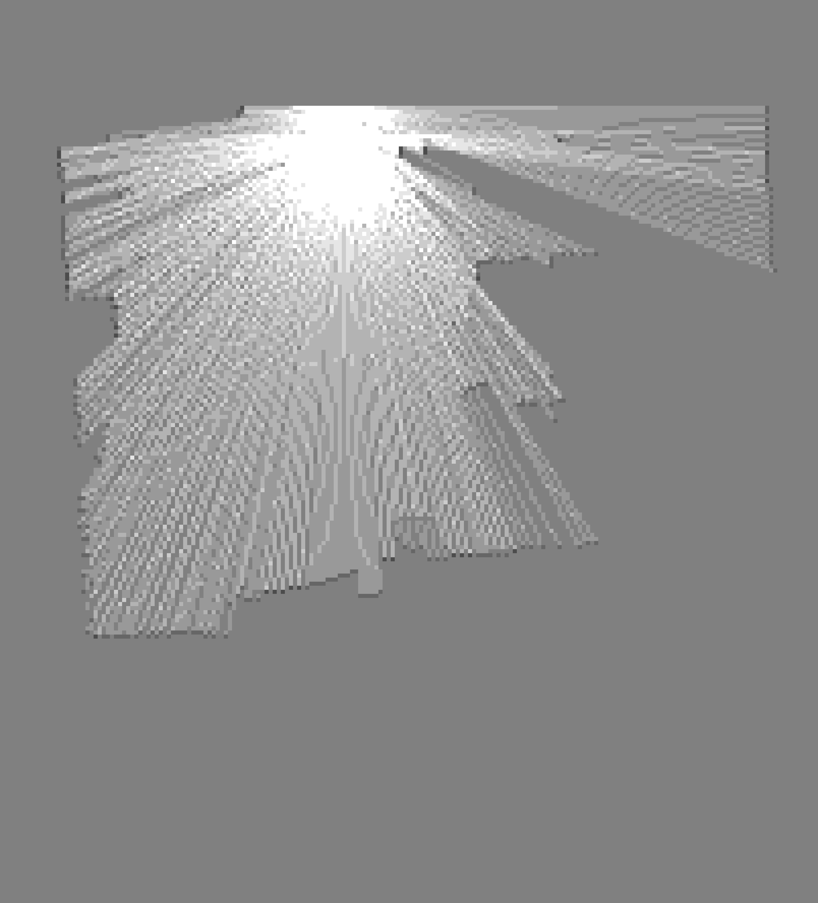
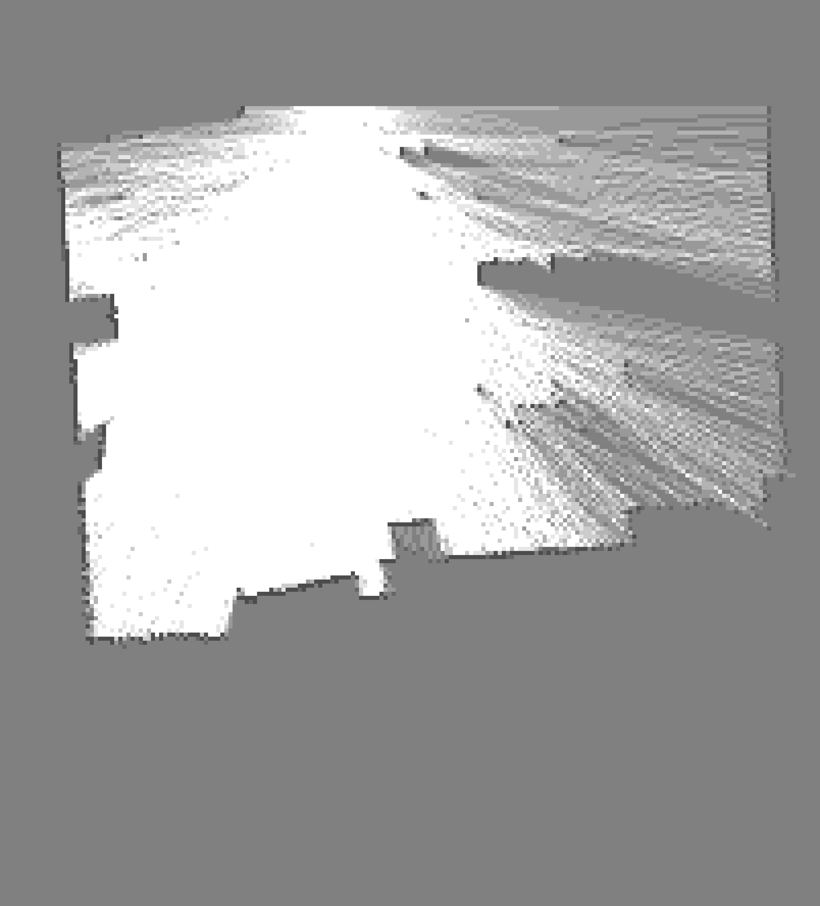
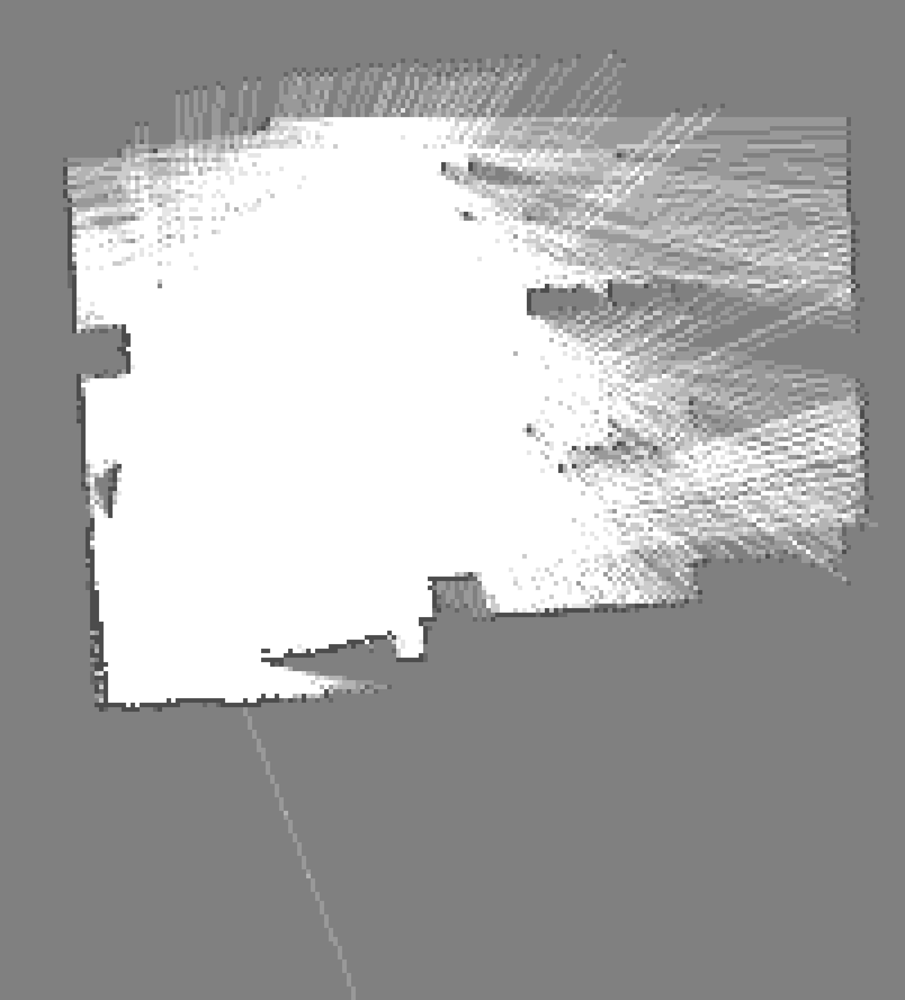
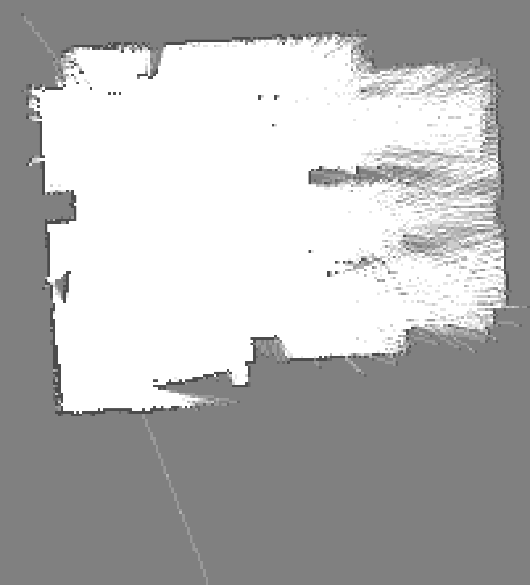
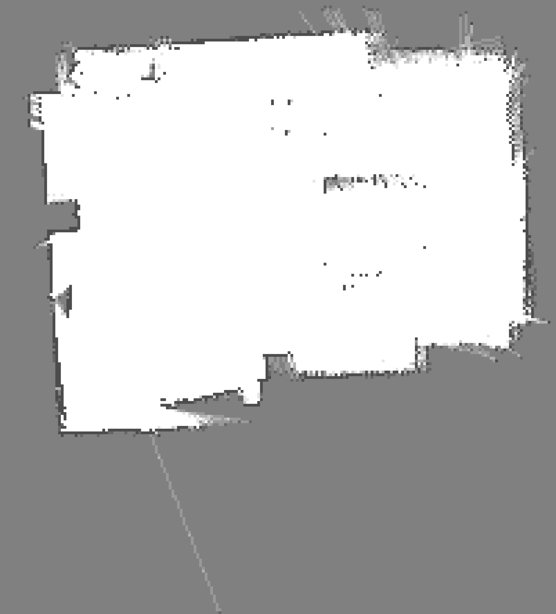
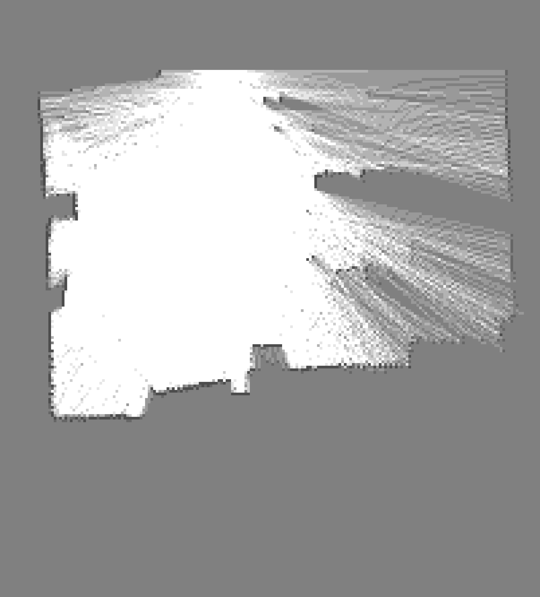
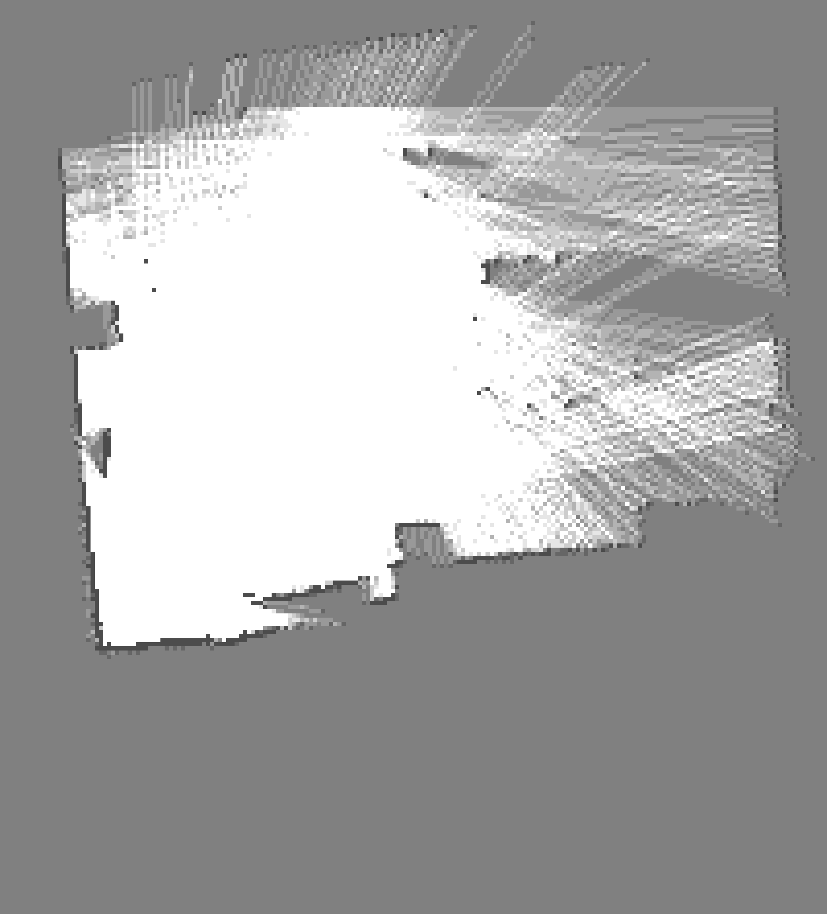
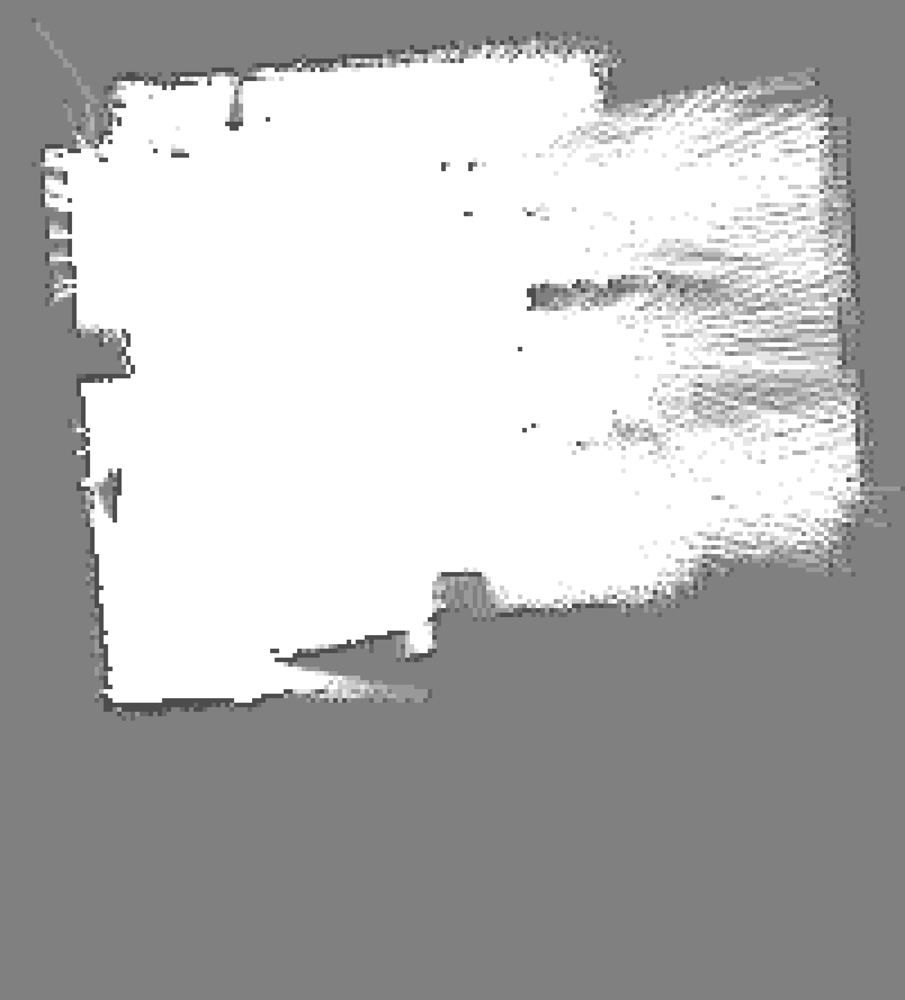

# FastSLAM
A particle-based FastSLAM algorithm in Python for pioneer 3dx mobile robot

This algorithm takes in a .2d format laser scan log and returns a 2d array grid map

Size of the map is bounded by the maximum and minimum scan coord in the scan hisotory. Thus, this is not an online slam algorithm.

## Usage

1. obtain a .2d file from the robot using sickLogger
2. open `slam.py`, modify parameters like `filename`, `num_particles`, `result_folder`, etc.
3. run `python3 slam.py`

## Files

*slam.py*: the main code for running the slam algorithm

*particle_class.py*: code for the particle class, including position update, map update, weight update

*scan_match.py*: scan-match algorithms, including icp and a customized algorithm called `search_best_angle`

*utility.py*: important utilities, including coord transfomation, map drawing, and ray tracing

*jerodlab.2d*: a sample .2d laser log of jerod's lab

*baseline_map.png*: a baseline map of jerod's lab constructed using only the laser log and without any slam correction

*map_slam.png*: a map of jerod's lab constructed using slam

*map_naive.png*: a map of jerod's lab constructed using slam but w/o scan-matching

*progress_full*: a folder containing the construction history of the slam map

## Progress Demo

### Baseline:

### SLAM:

### SLAM without Scan-Matching:

